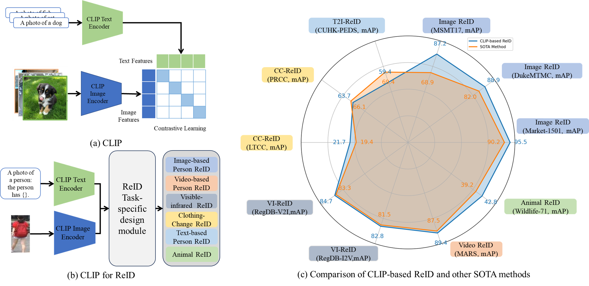
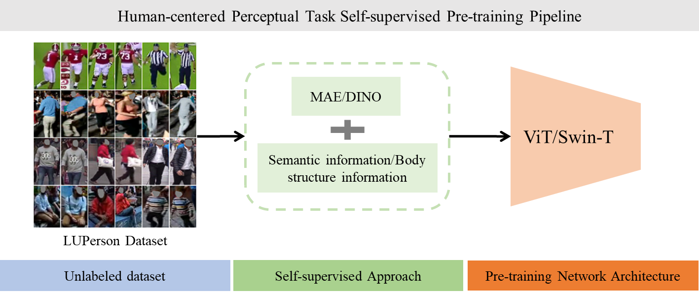
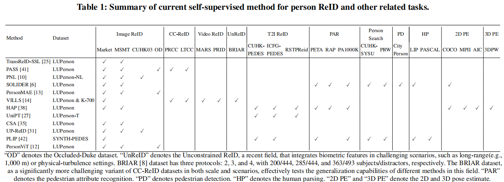
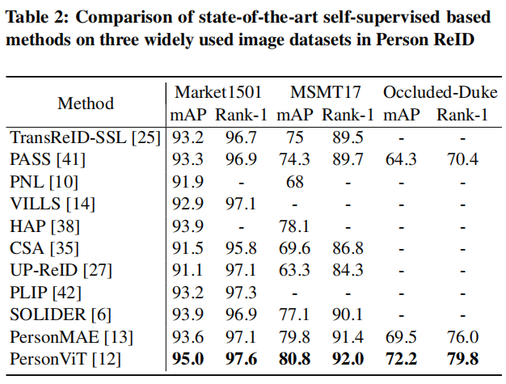
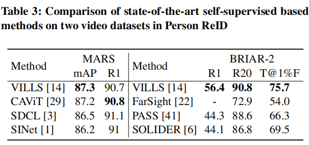

# Awesome-Evolving-ReID
Evolving ReID: Harnessing Large Pre-trained Models, Multi-Task Learning, Privacy-Preserving and Attack Techniques[](https://github.com/sindresorhus/awesome)

This is a repository for organizing articles related to advancing beyond traditional person re-identification methods. Most papers are linked to the pdf address provided by "arXiv" or "Openaccess". However, some papers require an academic license to browse. For example, IEEE, springer, and elsevier journal, etc.

## Paper
## One for All: A Review of Large Pre-training Models for Re-Identification

> [One for All: A Review of Large Pre-training Models for Re-Identification]() <br>


If you find this repository helpful, please consider citing:

```BibTeX
@article{Dou2025PersonReid,
  title={One for All: A Review of Large Pre-training Models for Re-Identification},
  author={Yubing Sun and Shuguang Dou and Ding Qi and Yanping Li and Jiale Zhao and Cairong Zhao},
  journal={WWW Companion '25},
  year={2025}
}
```


### 1. Introduction
This paper surveys the use of large pre-trained models and CLIP models for ReID, highlighting their potential to address these challenges through strong feature extraction and adaptability across multiple tasks.


### 2. CLIP for Object Re-identification

<div align="center">
  
  <p><b>Overview of CLIP-based ReID methods</b></p>
</div>

### 3.  Self-supervised Methods for Person ReID and Other Related Tasks

<div align="center">
  
  <p><b>A self-supervised human-centered perceptual task pre-training framework</b></p>
</div>
<div align="center">
  
</div>

<div align="center">
  
</div>

<div align="center">
  
</div>
 
---


## Statistics

| Direction | 2021| 2022| 2023|2024|
|---      |---|---|---|---|
| One for all| 1 | 4 | 12 | 8|
| All in one | 1 | 4 | 8 | 3 |
| Privacy and Security | - | 13 | - | - |

---

## Other contents
- [Datasets](#datasets)

---
## One for all

- <ins>***Person re-identification***</ins>
-  ***2021***

> ###### 1) *"PHA: Patch-Wise High-Frequency Augmentation for Transformer-Based Person Re-Identification"* [[paper](https://openaccess.thecvf.com/content/CVPR2023/papers/Zhang_PHA_Patch-Wise_High-Frequency_Augmentation_for_Transformer-Based_Person_Re-Identification_CVPR_2023_paper.pdf)]

- ***2022***
> ###### 1) *"Large-Scale Pre-Training for Person Re-Identification With Noisy Labels"* [[paper](https://openaccess.thecvf.com/content/CVPR2022/papers/Fu_Large-Scale_Pre-Training_for_Person_Re-Identification_With_Noisy_Labels_CVPR_2022_paper.pdf)]
> ###### 2) *"Unleashing Potential of Unsupervised Pre-Training With Intra-Identity Regularization for Person Re-Identification"* [[paper](https://openaccess.thecvf.com/content/CVPR2022/papers/Yang_Unleashing_Potential_of_Unsupervised_Pre-Training_With_Intra-Identity_Regularization_for_Person_CVPR_2022_paper.pdf)]
> ###### 3) *"PASS: Part-Aware Self-Supervised Pre-Training for Person Re-Identification"* [[paper](https://www.ecva.net/papers/eccv_2022/papers_ECCV/papers/136740192.pdf)]
> ###### 4) *"Self-Supervised Person Re-Identification with Channel-Wise Transformer"*,  IEEE International Conference on Big Data (Big Data) 2022 [[paper](https://ieeexplore.ieee.org/stamp/stamp.jsp?tp=&arnumber=10020632)] 
- ***2023***
> ###### 1) *"An Empirical Study of CLIP for Text-based Person Search"*, AAAI 2024 [[paper](https://arxiv.org/pdf/2308.10045)] [[github](https://github.com/flame-chasers/tbps-clip)]
> ###### 2) *"Beyond Appearance: a Semantic Controllable Self-Supervised Learning Framework for Human-Centric Visual Tasks"* [[paper](https://arxiv.org/pdf/2303.17602)]  [[github](https://github.com/tinyvision/SOLIDER)]
> ###### 3) *"Unveiling the power of clip in unsupervised visible-infrared person re-identification "*,[[paper](https://dl.acm.org/doi/pdf/10.1145/3581783.3612050)] [[github](https://github.com/CzAngus/CCLNet)]
> ###### 4) *"PersonMAE: Person Re-Identification Pre-Training with Masked AutoEncoders"*, IEEE Transactions on Multimedia 2023 [[paper](https://arxiv.org/pdf/2311.04496v1.pdf)]
> ###### 5) *"Prototypical Contrastive Learning-based CLIP Fine-tuning for Object Re-identification"*, arXiv 2023 [[paper](https://arxiv.org/pdf/2310.17218)] [[github](https://github.com/RikoLi/PCL-CLIP)]
> ###### 6) *"CLIP-Driven Cloth-Agnostic Feature Learning for Cloth-Changing Person Re-Identification"*, aeXiv 2024 [[paper](https://arxiv.org/pdf/2406.09198)] 
> ###### 7) *"CLIP-ReID: Exploiting Vision-Language Model for Image Re-Identification without Concrete Text Labels"*, AAAI 2023 [[paper](https://arxiv.org/pdf/2211.13977)] [[github](https://github.com/Syliz517/CLIP-ReID)]
> ###### 8) *"Exploring Part-Informed Visual-Language Learning for Person Re-Identification"*, arXiv 2023 [[paper](https://arxiv.org/pdf/2308.02738)] 
> ###### 9) *"Unified Pre-training with Pseudo Texts for Text-To-Image Person Re-identification"* [[paper](https://openaccess.thecvf.com/content/ICCV2023/papers/Shao_Unified_Pre-Training_with_Pseudo_Texts_for_Text-To-Image_Person_Re-Identification_ICCV_2023_paper.pdf)] [[github](https://github.com/ZhiyinShao-H/UniPT)]
> ###### 10) *"CLIP-Driven Fine-grained Text-Image Person Re-identification"*, IEEETIP 2024 [[paper](https://arxiv.org/pdf/2210.10276)] [[github](https://github.com/shuanglinyan/CFine)]
> ###### 11) *"TF-CLIP: Learning Text-free CLIP for Video-based Person Re-Identification"*, AAAI 2023 [[paper](https://arxiv.org/pdf/2312.09627)] [[github](https://github.com/AsuradaYuci/TF-CLIP)]
> ###### 12) *"Multi-Prompts Learning with Cross-Modal Alignment for Attribute-Based Person Re-identification"*, AAAI 2024 [[paper](https://arxiv.org/pdf/2312.16797)]

- ***2024***
> ###### 1) *"PersonViT: Large-scale Self-supervised Vision Transformer for Person Re-Identification"*, Machine Vision and Applications 2020 [[paper](https://arxiv.org/pdf/2408.05398)] [[github](https://github.com/hustvl/personvit)]
> ###### 2) *"VILLS -- Video-Image Learning to Learn Semantics for Person Re-Identification"*, arXiv 2023 [[paper](https://arxiv.org/pdf/2311.17074)] 
> ###### 3) *"Toward Re-Identifying Any Animal"*, NIPS 2024 [[paper](https://papers.nips.cc/paper_files/paper/2023/file/7df69dbf39705c7a39b40f2d70e806c1-Paper-Conference.pdf)] [[github](https://github.com/JiaoBL1234/wildlife)]
> ###### 4) *"Distilling CLIP with Dual Guidance for Learning Discriminative Human Body Shape Representation"* [[paper](https://openaccess.thecvf.com/content/CVPR2024/papers/Liu_Distilling_CLIP_with_Dual_Guidance_for_Learning_Discriminative_Human_Body_CVPR_2024_paper.pdf)]
> ###### 5) *"A Pedestrian is Worth One Prompt: Towards Language Guidance Person Re-Identification"* [[paper](https://openaccess.thecvf.com/content/CVPR2024/papers/Yang_A_Pedestrian_is_Worth_One_Prompt_Towards_Language_Guidance_Person_CVPR_2024_paper.pdf)]
> ###### 6) *"CLIP-Driven Semantic Discovery Network for Visible-Infrared Person Re-Identification"*, IEEE Transactions on Multimedia 2024 [[paper](https://arxiv.org/pdf/2401.05806)] [[github](https://github.com/nengdong96/csdn)]
> ###### 7) *"Multi-Prompts Learning with Cross-Modal Alignment for Attribute-Based Person Re-identification"*, AAAI 2024 [[paper](https://arxiv.org/pdf/2312.16797)]
> ###### 8) *"PLIP: Language-Image Pre-training for Person Representation Learning"*, aarXiv 2023 [[paper](https://arxiv.org/pdf/2305.08386)] [[github](https://github.com/zplusdragon/plip)]


---

## All in one

- <ins>***Person re-identification***</ins>
> ###### 1) *"LapsCore: Language-Guided Person Search via Color Reasoning"* [[paper](https://openaccess.thecvf.com/content/ICCV2021/papers/Wu_LapsCore_Language-Guided_Person_Search_via_Color_Reasoning_ICCV_2021_paper.pdf)]
> 


---

## Datasets

- LU-Person[[page](https://github.com/DengpanFu/LUPerson)]
- LU-Person's variants：
  - LU-Person-NL[[page](https://github.com/DengpanFu/LUPerson-NL)]
  - LU-Person-T[[page](https://huggingface.co/datasets/tuandunghcmut/LUPerson-T)]
- SYNTH-PEDES[[page](https://paperswithcode.com/dataset/synth-pedes)]

---

## Reference 

[https://github.com/handong1587/handong1587.github.io/blob/master/_posts/deep_learning/2015-10-09-re-id.md](https://github.com/bismex/Awesome-person-re-identification/blob/master/README.md)

---

## README

**People who meet the following criteria are free to request a pull (pull request).**
- Suggestions for new categories
- Changes to categories for some articles
- Corrections to the statistical tables
- Additions of a summary or performance

---

## Search keyword

- person
- identification
- large vision model
- self-supervised

---

## Previous change history
### :high_brightness: Updated 2025-02-19
- The GitHub page for "Awesome-Evovling-ReID" has been created.

### :high_brightness: Updated 2025-02-21
- We have updated the Large Pre-trained Models, the CLIP Models and datasets for ReID that are from 2021 to 2024.


**We will immediately reflect the matter if it should be corrected. We hope this github page helps many people with research purposes.**
